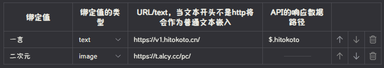
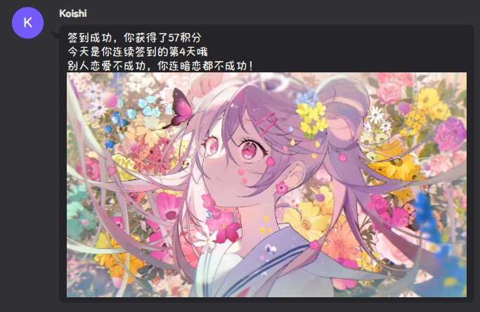

# koishi-plugin-codegang-qd

   

> ![IMPORTANT]
> 2.0.4版本修复了签到时间错误的混用了本地时间和UTC时间的问题，请尽快更新至2.0.4及以上版本

## 简介

这是一个高度可自定义的签到插件，适用于 Koishi 框架。该插件允许用户进行签到操作，并可以根据配置获得积分奖励。插件支持自定义签到文本、签到失败文本以及已签到文本，同时还可以集成外部 API 来丰富签到体验。

## 主要特点

- **高度自定义**：可以自定义签到成功、失败和已签到的文本内容
- **积分系统集成**：与 Koishi 的积分系统（pointmint）集成，签到可获得积分奖励
- **随机积分**：支持设置最小和最大积分范围（minplusnum 和 maxplusnum）
- **API 集成**：可以集成外部 API，如一言、二次元图片等
- **运势功能**：签到时可显示用户运势

## 命令
- `签到` - 进行签到操作
## 签到自定义文本变量

插件支持在签到的自定义文本中使用以下变量以构建更加个性化的签到样式：

- `{AT}` - 艾特用户  
- `{username}` - 用户昵称  
- `{points}` - 用户获得的积分  
- `{fortune}` - 用户运势  
- `{time}` - 用户签到时间  
- `{totalpoints}` - 用户总积分  
- `{<key>}` - 其他绑定值（如一言、二次元等自定义 API 返回内容）

## apiList

通过配置apiList可以实现签到时调用api的返回内容，以下是各项的含义：

| 名称 | 说明 |
| ---- | ---- |
| `绑定值` | 用于在自定义文本中使用的键 |
| `绑定值的类型` | 可选为`text`/`image`，即文本和图片 |
| `URL/text` | api地址或文本。当文本不是http开头将作为普通文本使用 |
| `数据路径` | 用于解析api返回的json数据，可通过[🔗*JSONPath Online Evaluator*](https://jsonpath.com/)测试好后填入，保持空值将会直接将链接的图片直接发送 |

例如，我配置了如下apiList：


那么就可以在自定义文本中这样使用：
```text
签到成功，你获得了{points}积分
今天是你连续签到的第{consecutive_days}天哦
{一言}
{二次元}
```

返回结果将会是：



## 依赖

该插件依赖以下服务：
- point（来自[koishi-plugin-pointmint](https://github.com/DMB-codegang/koishi-plugin-PointMint)，用于给予货币）
- puppeteer（来自[koishi-plugin-puppeteer](https://github.com/koishijs/koishi-plugin-puppeteer)，用于用户当日运势）
- http（来自[@koishijs/plugin-http](https://github.com/cordiverse/http)，用于api调用）
